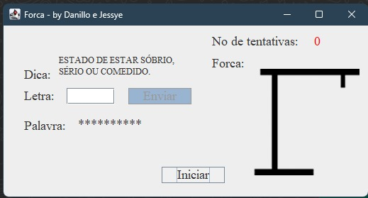

# Forca Project


> Projeto de jogo da forca dedicado à diciplina de POO.

## 📸 Layout


## 🛠️ Techs
<div>
  
</div>

## 👩‍💻 Estrutura do projeto

```
/src
└── AplicacaoConsole.java
└── JogoDaForca.java
└── TecladoJogo.java
└── /imgagens
    └── 0.png
    └── 1.png
    └── 2.png
    └── 3.png
    └── 4.png
    └── 5.png
    └── 6.png
└── /dados
    └── palavras.txt

```
## 🤝 Colaboradores

<table>
  <tr>
    <td align="center">
      <a href="#" title="Danillo Coelho">
        <br>
        <sub>
          <b>Danillo Coelho</b>
        </sub>
      </a>
    </td>
    <td align="center">
      <a href="#" title="Jessye Pereira">
        <br>
        <sub>
          <b>Jessye Pereira</b>
        </sub>
      </a>
    </td>
  </tr>
</table>
